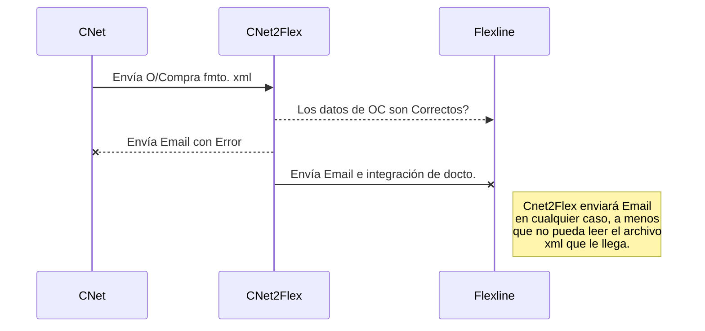

# Integración ComercioNet a Flexline

[[toc]]

## Objetivo
La guía de referencia para el uso de la aplicación de consola CNet2Flexline cuyo objetivo es leer archivos .xml provenientes desde la aplicación ComercioNet que corresponden a Órdenes de Compra para que sean procesadas, validadadas e integradas al ERP Flexline.

## Tecnología
Es una aplicación de consola creada con C# (Visual Studio for Mac 2019)
.NET Core SDK version: 3.1.6

## Release e Historias
* 1.0 Nov-2020, Versión Original liberada

## Instalación
- Si bien la aplicación puede funcionar en Linux e iOS, la entrega se realizó sobre un servidor Windows.  
- Requiere .NET Core 3.1.6 o superior.
- La Estructura es por cada empresa, por lo que para configurar más de una se debe duplicar las instancias.

::: warning
Para cada empresa se debe configurar el archivo [**CNET2FLEX_Config.xml**](./config.md)
:::

La estructura de la app es la siguiente:

    - / (Raíz)
        - CNet2Flexline
            - Empresa
                - Logs
                    - CNET2FLEXlog_AAAA_MM_DD.log
                - CNet2Flexline.Exe
                - CNET2FLEX_Config.Xml
                - CNet2Flexline.dll
                - CNet2Flexline.pdb
                - CNet2Flexline.deps.json
                - CNet2Flexline.runtimeconfig.json
                - *.dll (desde paquete autoinstalable)

## Guía Rápida
- Configurar archivo CNET2FLEX_Config.xml
- Ejecutar Aplicación
- Si encuentra OC disponibles las procesa y envía correo a usuario informando el resultado
- Integrar documento en Flexline ERP

## Diagrama de uso

