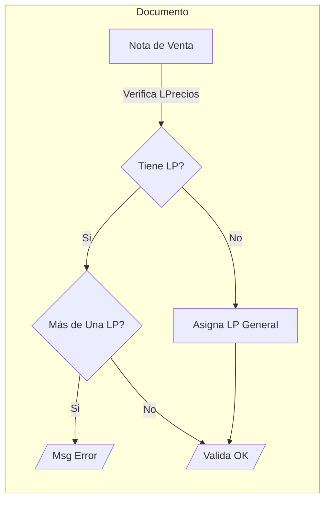
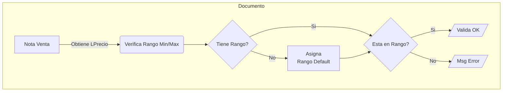
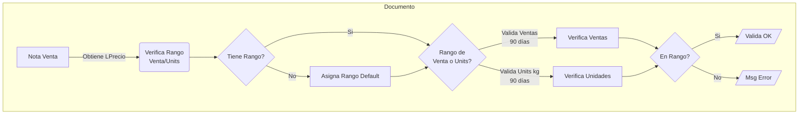
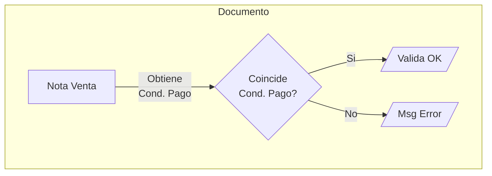
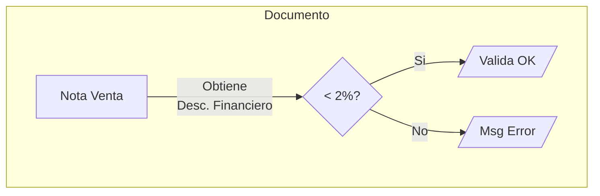

# Validación de Notas de venta - Autoventa

Corresponde a la validación que se realiza sobre los documentos Notas de venta que son generados por la aplicación Autoventa.io

- Estos documentos son inyectados por la app autoventa por medio de los Web services disponibles en el servidor de Flexline creados para estos efectos.
- Una vez que Autoventa llama el servicio de Flexline, éste inserta el documento a tablas de la familia GEN_XXXXXXXX (Gen_Documento, Gen_Documentod, etc.) para que puedan ser ingresados al ERP a partir de la ejecución de la aplicación “Integrador de Documentos”
- Al momento de insertar los registros se gatilla un Trigger SQL (sobre tabla Gen_DocumentoV) que ejecuta un Store procedure llamado “Valida_NV_Autoventa” que posee la lógica de negocios.
- Este procedimiento devuelve el resultado de la validación en formato HTML para que posteriormente se envíe un correo al usuario con resultados de la validación.

## Validaciones

### Nota de Venta posee productos con precios en varias Lista de Precios (LP Cliente y LP General)

- Valida que la NV tenga productos en sólo una Lista de Precios
- Si Cliente no posee LP definida en maestro de clientes Flexline, asume LP general

#### Diagrama

---

### Nota de Venta con montos fuera de rango Mínimo/Máximo habitual

- Verifica los montos mínimos y máximos definidos en el "Mantenedor de Tramos" de cada Lista de precios.
- Si Cliente no posee LP definida en maestro de clientes Flexline, asume LP general
- Si la Lista de precio del cliente no posee Definición (Receta = "MinMax"), la validación tomará los valores por defecto que están definidos en el "Mantenedor de Tramos" de LP "PRUEBA 2" (ver anexo 1)

::: tip Importante

- Si el cliente tiene definido Fastrack en campo de _Ctacteanalisis10_ del maestro, obvia la validación.
  :::

#### Diagrama

---

### Descuentos por volumen fuera de la regla (Venta / Unidades)

- Considera dos tipos: por Unidades vendidas o por Venta Neta
- En ambos casos revisa las ventas de los últimos 90 días y compara esos resultados contra lo definido en el “Mantenedor de Tramos” definida en la lista de precios del cliente.
- Si la Lista de precio del cliente no posee Definición (Receta = “NETO” o “CANTIDAD”), la validación tomará los valores por defecto que están definidos en el "Mantenedor de Tramos" de LP "PRUEBA 2" (ver anexo 1)
- Si la definición de la tabla es en “CANTIDAD”, la validación comparará los Kilos de los últimos 90 días contra el rango definido en la Lista de Precios. Por el contrario, si la definición de la tabla es en “NETO”, la validación se realizará comparando los últimos 90 días de compra.

::: tip Importante

- Si el cliente tiene definido Fastrack en campo de _Ctacteanalisis10_ del maestro, obvia la validación del descuento.
  :::

#### Diagrama

---

### Cond. de Pago no coincide con la registrada en el Maestro de Clientes

- Verifica que la condición de pago que viene en la Nota de Pedido sea la misma registrada en el maestro de clientes de Flexline
- Autoventa realiza la carga periódica de los datos existentes desde Flexline, por lo que no deberían existir casos regulares.

#### Diagrama

---

### Cliente Barométrico, verificar condiciones de mercado

- Marca de campo AnalisisCtacte9 en maestro de Clientes sobre entidades que pueden marcar un desajuste de mercado, es más una alerta que invita a revisar las condiciones de mercado sobre los productos que se están comprando.

---

### Requiere aprobación por existencia de Desc. Logístico o Especial

- Corresponde a los descuentos 4 y 5 los cuales siempre deben ser verificados.

---

### Requiere Aprobación por Desc. Financiero

- Corresponde al descuento 2, este no debe superar el 2% (valor fijo sin parametrizar)

#### Diagrama

---

### Venta bajo el costo

- Compara el costo (CUP del producto calculado a la fecha de ingreso de la Nota de venta) contra los precios con descuentos incluidos otorgados en el documento Nota de Venta.

---

### Cliente con problemas de morosidad

- Verifica morosidad del cliente no supere 10%

---

### Supera límite de crédito

- Compara los valores de Deuda, montos pendientes de despacho y montos pendientes de integrar contra el valor de Línea de crédito que se especifica en el maestro de clientes.

---

### Dirección de Despacho no coincide con maestro

- Verifica que la dirección de despacho existente en la nota de venta exista en el maestro de Direcciones de Flexline, esto para evitar problemas al momento de emitir la factura posterior.

---

### Stock Insuficiente

- Verifica el stock para la Nota de venta, considerando las unidades de la Nota de venta, otros documentos por despachar y otros documentos por integrar.
- Excluye de la validación de Stock productos con SUBTIPO 'A N/A IMP'

---

### Aviso de 50% Despacho del Stock

- Verifica que la cantidad de productos solicitados en la Nota de Venta no sean mayores al 50% del stock del producto disponible en bodegas. Implica un potencial quiebre de stock o un potencial desajuste del mercado.

---

## Correo Generado

- 1.0 Nov-2020, Versión Original liberada

::: warning
Para cada empresa se debe configurar el archivo [**CNET2FLEX_Config.xml**](./config.md)
:::
